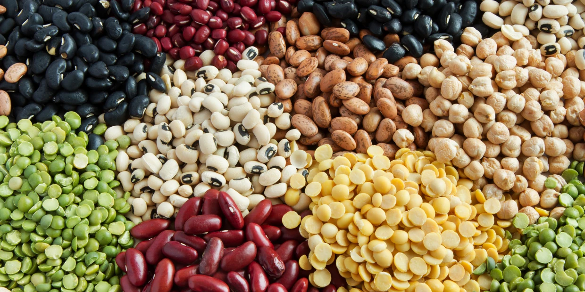

# DRY_BEAN_CLASSIFIER |  | |   |  |   |  |  |[ ](https://github.com/Carlos93U) | [](https://www.linkedin.com/in/juan-carlos-huillcas/) |

<center>



</center>

## 1. Resume

In this project, the *Dry Bean Dataset* available on Kaggle has been utilized. This dataset comprises information about various physical characteristics of different types of dry beans. The primary objective of the project is to conduct data analysis, explore relationships among the different features, develop predictive models, and evaluate their performance to determine the best model for predicting the type of bean.

## 2. Dataset Characteristics

The dataset contains the following features:

| Feature               | Description                                                                                                    |
|-----------------------|----------------------------------------------------------------------------------------------------------------|
| Area (A)              | The area of a bean zone and the number of pixels within its boundaries.                                        |
| Perimeter (P)         | Bean circumference is defined as the length of its border.                                                     |
| Major axis length (L)| The distance between the ends of the longest line that can be drawn from a bean.                               |
| Minor axis length (l)| The longest line that can be drawn from the bean while standing perpendicular to the main axis.               |
| Aspect ratio (K)      | Defines the relationship between L and l.                                                                      |
| Eccentricity (Ec)     | Eccentricity of the ellipse having the same moments as the region.                                              |
| Convex area (C)       | Number of pixels in the smallest convex polygon that can contain the area of a bean seed.                      |
| Equivalent diameter (Ed)| The diameter of a circle having the same area as a bean seed area.                                            |
| Extent (Ex)           | The ratio of the pixels in the bounding box to the bean area.                                                  |
| Solidity (S)          | Also known as convexity. The ratio of the pixels in the convex shell to those found in beans.                 |
| Roundness (R)         | Calculated with the following formula: (4piA)/(P^2)                                                            |
| Compactness (CO)      | Measures the roundness of an object: Ed/L                                                                      |
| ShapeFactor1 (SF1)   |                                                                                                                |
| ShapeFactor2 (SF2)   |                                                                                                                |
| ShapeFactor3 (SF3)   |                                                                                                                |
| ShapeFactor4 (SF4)   |                                                                                                                |
| Class                 | Seker, Barbunya, Bombay, Cali, Dermosan, Horoz, and Sira.                                                      |


## 3. Setting up

*Create a virtual enviroment with:*

```
python3 -m venv env

```
*Activate virtual enviroment:*

```
source env/bin/activate
```

*Install requirements*

```
pip install -r requirements.txt
```

## 4. Running

* *Open a dry_bean_classifier notebook*
* *Run All*
* *See outputs*


Bean class distribution

[](https://postimg.cc/WFYW2djS)

Accuracy of models

[](https://postimg.cc/34xf5XMd)

## 5. Conclutions:

* Using undersampling helps address data imbalance, enhancing accuracy in Dermosan prediction, albeit potentially resulting in fewer training data.

* Sample reduction mitigates biases, though fewer data minimize prediction errors.

* Undersampling's advantage lies in improving accuracy by correcting imbalance, but real data loss may limit representativeness.

* The risk of creating synthetic data or removing essential information was avoided, ensuring sufficient observations for accurate predictions.

* Successful outcomes stem from effective data cleaning and scaling, ensuring higher quality in final predictions.

## 5. Libraries and documentation

* [Python](https://www.python.org/doc/)
* [sklearn](https://scikit-learn.org/stable/)
* [pandas](https://pandas.pydata.org/)
* [numpy](https://numpy.org/)
* [matplotlib](https://matplotlib.org/)
* [seaborn](https://seaborn.pydata.org/index.html#)
* [imblearn](https://imbalanced-learn.org/stable/)
* [ydata_profiling](https://docs.profiling.ydata.ai/latest/)


## 6. Sources
* [Kaggle](https://www.kaggle.com/datasets/sansuthi/dry-bean-dataset)